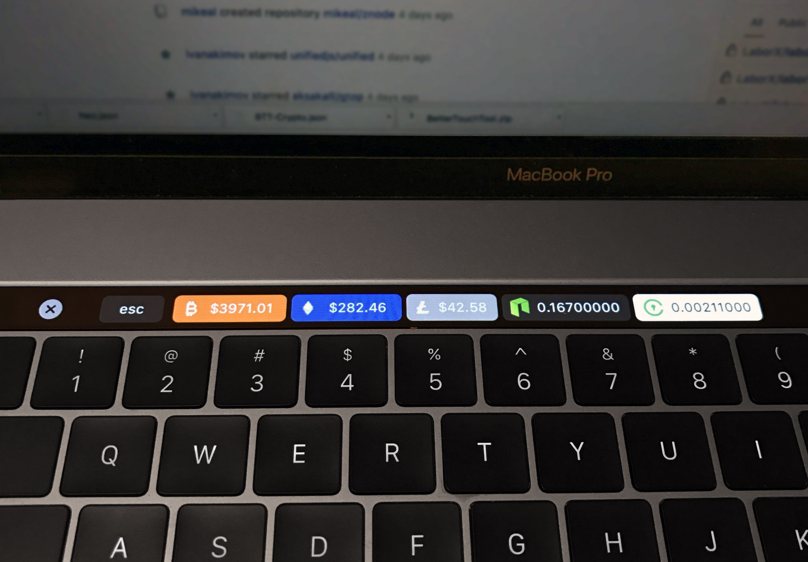

# bettertouchtool-crypto
Crypto stock market prices for your Macbook Pro touch bar! Values updated every minute.

Currently supported coins: 
- **Bitcoin** - Pulled from Coinbase.com API.
- **Ethereum** - Pulled from Coinbase.com API.
- **Litecoin** - Pulled from Coinbase.com API.
- **Neo** - Pulled from bittrex.com API.
- **Civic** - Pulled from bittrex.com API.
- **TenX** - Pulled from bittrex.com API. (This is an addon under tenx.json)

# Notes: 
- All values are in USD.
- For values taken from bittrex.com, the very last price this coin was sold for is used.
- For **NEO**, **Civic**, **TenX** and any coin tracked on bittrex.com the USD price is calculated by the last sold etherium-altcoin transaction multiplied by the current Coinbase value of Etherium. For me, I felt like this was the most accurate representation for rather than using USDT markets.
- Once installed, you can delete any coins you are not interested in tracking.

# To Install

1. Download and install [Better Touch Tool](https://www.boastr.net/downloads/). It allows you to modify your touch bar and other cool things. It's a 45-day trial but "pay what you like" to register.
2. Right-click and download this file [crypto-krunkosaurus.json](https://raw.githubusercontent.com/krunkosaurus/bettertouchtool-crypto/master/crypto-krunkosaurus.json) to your desktop.
3. In your Mac's menu bar, click the Better Touch Tool `icon > Preferences`.
4. In the bottom left corner of the popup go to "Manage Presets". 
5. Click the "Import" button and select the `crypto-krunkosaurus.json` file you downloaded. Viola you're done!
6. If you want support for TenX, repeat step 5 with tenx.json. Note that you can toggle these separate presets on and off.

# Customization

- In the Better Touch Tool preferences panel, you can add, delete, and rearrange the currencies.
- Timing: Currently each currency is refreshed every 60 seconds. Change this by going to Better Touch Tool preferences panel, clicking on a currency, going to "advanced configuration", and adjusting the "run script every x seconds" amount. It's not recommended to go under 30 seconds or the server could ban you.

# Donations

_I am not the original author of this script._ I merely improved, optimized, and extended it to support more cryptocurrencies and other features. The original idea came from [here](https://steemit.com/neo/@awesomemo/get-the-latest-price-of-neo-on-your-macbook-touchbar).  Still some people have mentioned wanting to donate so here's how if you like:

- Ethereum: 0x28337E58c086c1019192D876490596B9CC5C5a2a
- Doge: D8WmX55mJiS8VxciwPhB1fr2swRR2agbJ6

# History
- V1.1: Support for displaying Neo and Civic in USD and not just Ethereum value. Click-support for Ethereum value.
- V1.2: Support for rounding dollar values so that they're not 20 characters long. :)
- V1.3: Add-on support for TenX.

# Acknowledgments

Thanks to the original source [here](https://steemit.com/neo/@awesomemo/get-the-latest-price-of-neo-on-your-macbook-touchbar) that my modified/optimized version is based on.
